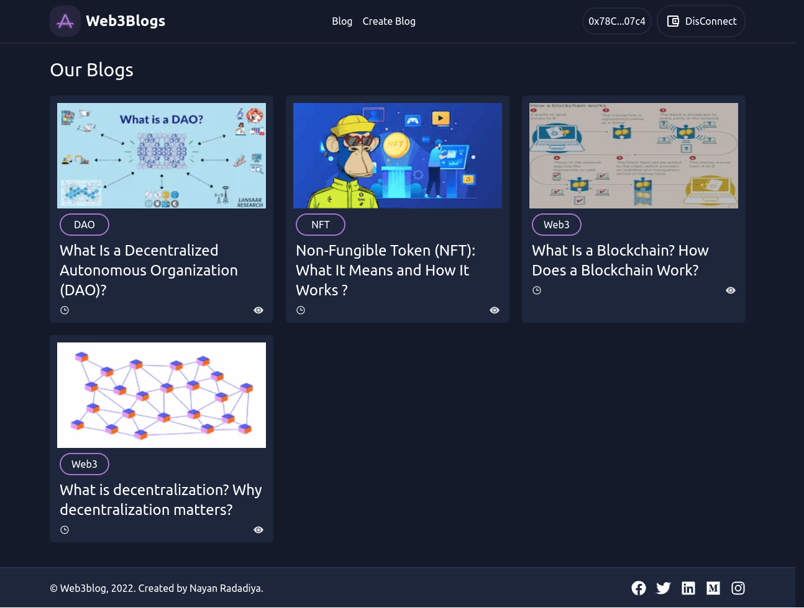
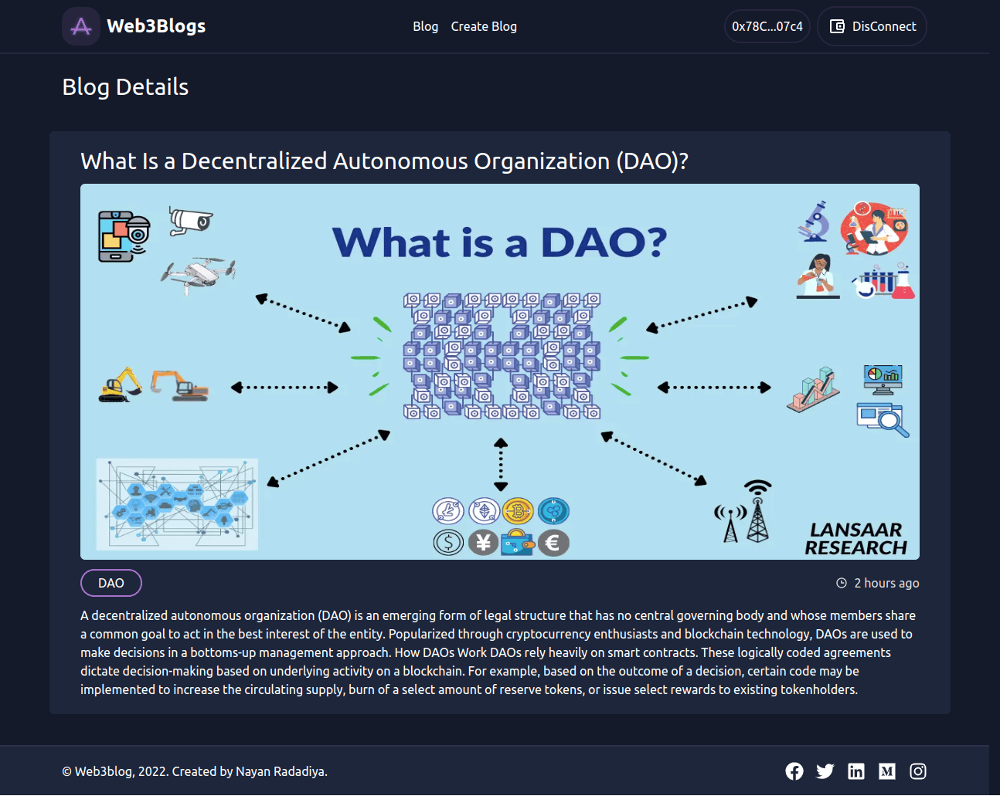
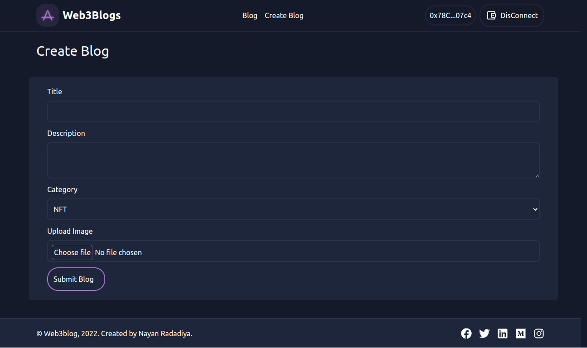
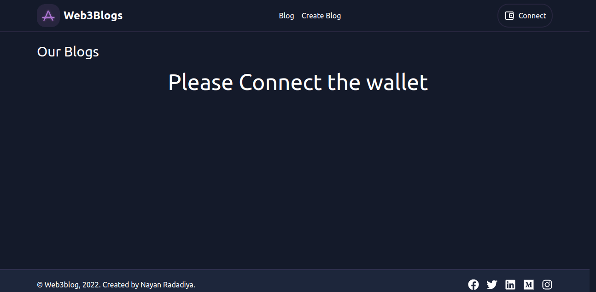
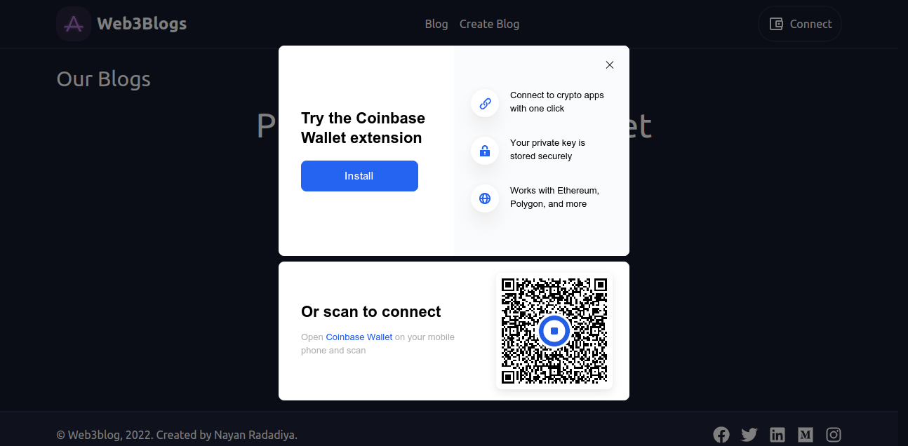
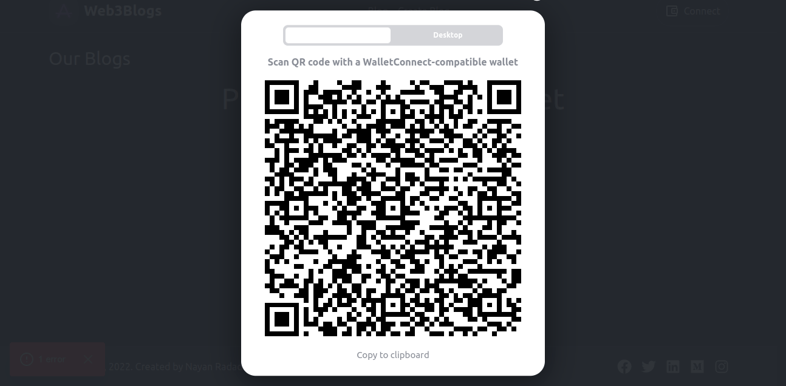

<!-- Run in Your local environment -->

# Prerequisites

* [nodejs](https://nodejs.org/en/download/) for backend smart contract deploy
* [MetaMask](https://chrome.google.com/webstore/detail/metamask/nkbihfbeogaeaoehlefnkodbefgpgknn) Chrome extension installed in your browser
* [Hardhat](https://hardhat.org/) for local smart contracts deployement and testing
* [nft.storage](https://nft.storage/) account for IPFS storage (free account).
* [polygon(mumbai)](https://faucet.polygon.technology/) Polygon mumbai balance for your smart contract deploy and NFT mint

## How to run in your Local environment

<dl>
    <dt>Step1: Clone GitHub Project on your PC</dt>
    <dd>
        
git clone https://github.com/nayanrdeveloper/web3blogs_fronted

    </dd>
    <dt>Step-2: </dt>
    <dd>
        
now change the file env.example to .env and update the following changes

        
NEXT_PUBLIC_ALKEMY_KEY = "get polygon mumbai API key of alchemy platform"

        
NEXT_PUBLIC_PRIAVATE_KEY = "Wallet private key "

        
NEXT_PUBLIC_RPCURL = "get polygon mumbai RPC URL of alchemy platform"

        
NEXT_PUBLIC_BLOG_CONTRACT = "Blog contract address"

        
NEXT_PUBLIC_NFT_STORAGE_KEY = "NFT.Storage api key"

    </dd>
    <dt>Step - 6: </dt>
    <dd>
        
npm install

        
npm run dev

        
Open your Project in browser (http://localhost:3000/)

    </dd>
</dl>

### Built With
* [Solidity](https://docs.soliditylang.org/)
* [Hardhat](https://hardhat.org/getting-started/)
* [Next.js](https://nextjs.org/)
* [ethers.js](https://docs.ethers.io/v5/)
* [wagmi.sh](https://wagmi.sh/)
* [TailwindCss](https://tailwindcss.com/)

#### User interface
   
The front end is built with Next JS it's framework of React, it allows users to mint new NFTS and they can find on the home page a complete roadmap for the entire NFT project, the app also give a simple admin dashboard for setting minting prices and managing the sales period.

The front-end is built using the following libraries:
      <ul>
        <li><b>Next.js:</b> fronted Framework of develope UI</li>
        <li><b>Ethers.js:</b> used as interface between the UI and the deployed smart contract</li>
        <li><b>Wagmi.sh:</b> for conecting to Metamask(wallet)</li>
        <li><b>Tailwind CSS:</b> Styles using TailwindCss</li>    
      </ul>

Create design pattern

Create Blog

Connect Wallet

Connect Coinbase

Connect Injected

